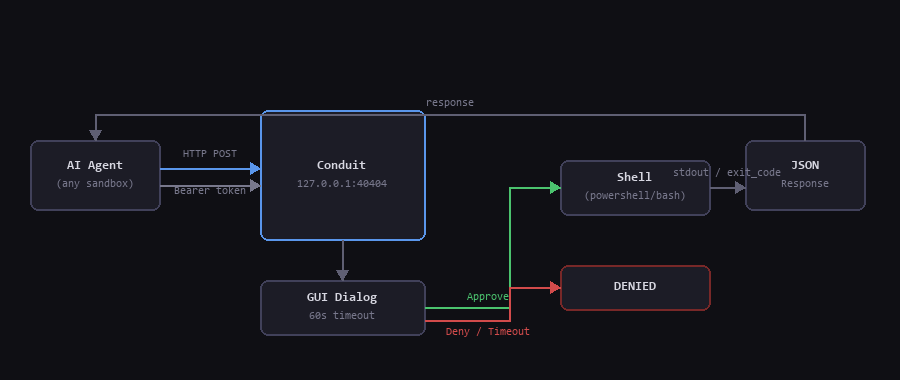
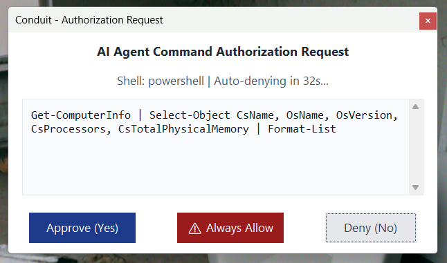

# Conduit

<p align="center">
  
</p>

**The escape hatch for AI coding agents.**

Every AI coding assistant (Cursor, Codex, Claude Code, Antigravity, and others) runs inside a sandboxed terminal. That sandbox is intentional: it exists to prevent accidental damage. But it also creates a hard wall that stops your AI from doing real system-level work.

Inside the sandbox, your AI **cannot**:

- Install system-wide packages or software (`apt`, `brew`, `winget`, `msi`)
- Start, stop, or configure system services
- Write to protected system directories (`/etc`, `/usr/local`, `C:\Windows`, `C:\Program Files`)
- Run any command that requires `sudo` on Linux/macOS or UAC elevation on Windows
- Modify firewall rules, network interfaces, or DNS settings
- Manage user accounts or file permissions at the OS level

**Conduit breaks out of that wall.**

It's a tiny Python process you run *outside* the AI's sandbox, with full admin privileges. The AI sends commands to it over localhost HTTP. You see a GUI approval dialog for every single command. You click Yes or No. The output is returned to the AI. No plugins. No extensions. No config files. Just:

```bash
python run_conduit.py
```

## How It Works

<p align="center">
  
</p>

1. Start Conduit in an elevated terminal (or double-click `conduit.bat` on Windows).
2. Conduit prints a session token and opens the web dashboard in your browser.
3. Copy the one-click prompt from the dashboard and paste it into your AI agent chat.
4. The AI reads `http://127.0.0.1:40404/agent.md`, gets full integration instructions with the token.
5. AI sends privileged commands via HTTP. Each one triggers a GUI dialog on your screen.
6. You approve or deny. Output returns to the AI in structured JSON.

<p align="center">
  
</p>

## Quick Start

### Windows
Double-click `conduit.bat` (auto-elevates to Administrator) or:
```powershell
python run_conduit.py
```

### macOS / Linux
```bash
chmod +x conduit.sh
./conduit.sh
```

After launch, your browser opens at `http://127.0.0.1:40404/`. Copy the prompt and send it to your AI.

## Web Dashboard

Conduit hosts a local web dashboard at `http://127.0.0.1:40404/`. It shows:

- Live status (uptime, queue depth, platform)
- Current session token with one-click copy
- A "Copy Prompt" button you paste directly into your AI agent to activate Conduit

## API Endpoints

| Method | Path | Auth | Description |
|--------|------|:----:|-------------|
| `GET` | `/` | No | Web dashboard |
| `GET` | `/agent.md` | No | AI agent integration guide (with live token) |
| `POST` | `/` | Yes | Execute a privileged command |
| `GET` | `/status` | No | Health check, uptime, queue depth |
| `GET` | `/shells` | No | Available shells on this machine |
| `GET` | `/history` | Yes | Last 50 executed commands |

### Executing a Command (`POST /`)

```json
{
  "command": "Get-Disk | Format-Table -AutoSize",
  "shell": "powershell",
  "cwd": "C:\\optional\\path",
  "env": { "MY_VAR": "value" }
}
```

Plain-text body (no JSON) also works and runs in the default shell.

### Response

```json
{
  "status": "SUCCESS",
  "request_id": "uuid-v4",
  "shell_used": "powershell",
  "exit_code": 0,
  "output": "(stdout)",
  "stderr": "(stderr if any)",
  "duration_ms": 142.5
}
```

Status values: `SUCCESS`, `ERROR`, `DENIED`

## Integrating from Your AI Agent

The simplest integration uses only Python stdlib:

```python
import urllib.request, json

CONDUIT_TOKEN = "paste-your-session-token-here"

def conduit(command, shell="powershell", cwd=None, env=None):
    payload = {"command": command, "shell": shell}
    if cwd: payload["cwd"] = cwd
    if env: payload["env"] = env
    req = urllib.request.Request(
        "http://127.0.0.1:40404/",
        data=json.dumps(payload).encode("utf-8"),
        headers={
            "Content-Type": "application/json",
            "Authorization": f"Bearer {CONDUIT_TOKEN}"
        },
        method="POST"
    )
    with urllib.request.urlopen(req) as r:
        return json.loads(r.read().decode("utf-8"))
```

Or have the AI visit `http://127.0.0.1:40404/agent.md` — it receives a fully self-contained guide with the live token already embedded.

## Security Design

| Property | Detail |
|----------|--------|
| **Network scope** | Binds to `127.0.0.1` only, never exposed to external networks |
| **Human approval** | Every command requires an explicit GUI click before it runs |
| **Default deny** | The dialog defaults to No, approval is always an active choice |
| **60-second timeout** | Unanswered prompts are automatically denied |
| **Token auth** | Each session generates a fresh UUID token, only scripts that know it can submit commands |
| **No persistence** | Token and history vanish when Conduit is closed |

## Requirements

- **Python 3.8+** (standard library only, no `pip install` needed)
- On Windows: `tkinter` is included with the official Python installer
- On Linux: `tkinter` via `sudo apt install python3-tk` (or `zenity` as fallback)
- On macOS: `tkinter` is included; `osascript` used as fallback dialog

## Credits

Vibe coded by [@Rehan30g](https://github.com/Rehan30g)
